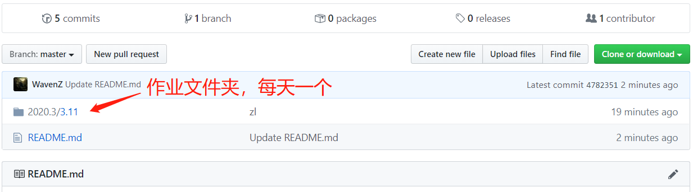

# BUAA 1504B go go go ...
BUAA 1504B 四位大神的刷题之旅

### 项目简介

1504B的每日刷题记录，包含C/C++、操作系统、计算机网络、数据库、算法五个部分。

### 使用说明

1. 联系我将您加入本项目成为collaborator。
2. 通过`git clone https://www.github.com/WavenZ/BUAA1504B.git` 将本仓库克隆到您的本地。
3. 每天上午11点会在项目内该日期文件夹下发布homework的markdown格式文件。

4. 您可以在github网站看到作业发布，或者利用`git pull`将最新更改拉取到本地。

5. 完成作业后可以在github网站在对应文件夹下提交作业，或者在本地修改之后通过`git push -u origin master`提交到远程`master`分支。（最好在git push之前git pull一下，以更新他人的最新更新）

6. 您也可以在开发的过程中先创建dev分支，最后合并到master分支。
### 注意

后期将加入权限管理，防止误删或者删库跑路哈哈。。
