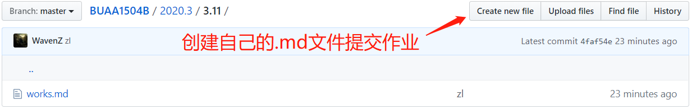

# BUAA 1504B go go go ...
BUAA 1504B 四位大神的刷题之旅

## 目录
* [项目简介](#项目简介)
* [使用说明](#使用说明)
* [权限](#权限)
* [为什么加入我们](#为什么加入我们)
* [刷题之旅](#刷题之旅)
  * [311](#311)
  * [312](#312)
  * [313](#313)
  * [314](#314)

## 项目简介

每日刷题记录，包含 C/C++、操作系统、计算机网络、数据库、算法五个部分。

## 使用说明

1. 联系我将您加入本项目成为collaborator。
2. 通过`git clone https://www.github.com/WavenZ/BUAA1504B.git` 将本仓库克隆到您的本地。
3. 每天上午 11 点前会在项目内特定日期文件夹下发布当日的 homework 的 markdown 格式文件 `works.md`。

4. 您可以在 github 网站看到作业发布，或者利用`git pull`将最近更新拉取到本地进行查看。

5. 完成作业后可以在 github 网站在对应文件夹下提交作业，或者在本地修改之后通过`git push -u origin master`提交到远程`master`分支。（最好在`git push`之前`git pull`一下，以更新他人的最新更新）

6. 您也可以在开发的过程中先创建`dev`分支，最后合并到`master`分支。
## 权限

由于本人也没有用 git/Github 进行协作开发的经历，因此目前还没有权限管理。后期将加入权限管理，防止误删或者删库跑路哈哈。。

## 为什么加入我们

本项目设立的初衷是相互督促刷题，为找工作做准备。同时，通过本项目，我希望我们还能学到 git/Github 的使用方法、markdown 的写作技巧等（程序员协作开发利器）。

## 刷题之旅
若有恒，何必三更起五更眠；最无益，莫过一日曝十日寒
### 311
* [static 关键字的作用有哪些？](2020.3/3.11/works.md)
* [C++ 中 struct 和 class 有哪些区别](2020.3/3.11/works.md)
* [进程与线程的关系以及区别？](2020.3/3.11/works.md)
* [进程间通信有哪些方式？它们的区别？](2020.3/3.11/works.md)
* [Http和Https的区别？](2020.3/3.11/works.md)
* [三次握手与四次挥手](2020.3/3.11/works.md)
* [事务四大特性？](2020.3/3.11/works.md)
* [数据库隔离级别？](2020.3/3.11/works.md)
* [链表的倒数第 k 个节点](2020.3/3.11/works.md)
* [股票的最大利润](2020.3/3.11/works.md)
### 312
* [C++ 中空类对象sizeof的返回值是多少？为什么不能是0？](2020.3/3.12/works.md)
* [C++ 中多态是怎么实现的？ ](2020.3/3.12/works.md)
* [扩容的时候内存用什么来分配？](2020.3/3.12/works.md)
* [怎么判断机器的大小端？](2020.3/3.12/works.md)
* [TCP、UDP区别？](2020.3/3.12/works.md)
* [网络里面为什么要有网络序的概念？是用来解决什么问题的？  ](2020.3/3.12/works.md)
* [什么是存储引擎？MySQL不同存储引擎间有什么区别？](2020.3/3.12/works.md)
* [数据库mysql索引机制，为什么要用B+树？](2020.3/3.12/works.md)
* [反转字符串中的单词 III](2020.3/3.12/works.md)
* [三色排序](2020.3/3.12/works.md)
### 313
* [多态能否用C语言实现？](2020.3/3.13/works.md)
* [区别指针函数和函数指针？](2020.3/3.13/works.md)
* [什么是死锁？死锁产生的条件？](2020.3/3.13/works.md)
* [进程有哪几种状态？](2020.3/3.13/works.md)
* [GET 和 POST 的区别？](2020.3/3.13/works.md)
* [为什么要三次握手、四次挥手？ ](2020.3/3.13/works.md)
* [什么是脏读？什么是幻读？](2020.3/3.13/works.md)
* [第一范式、第二范式、第三范式分别是什么？](2020.3/3.13/works.md)
* [反转一个单链表](2020.3/3.13/works.md)
* [一个数组中，找出除最大值之外的最大的k个数。 ](2020.3/3.13/works.md)
### 314
* [下列程序编译时，（1）（2）（3）（4）（5）中有语法错误的语句是](2020.3/3.14/works.md)
* [请说一下C/C++ 中指针和引用的区别？](2020.3/3.14/works.md)
* [操作系统中的缺页中断](2020.3/3.14/works.md)
* [操作系统中的结构体对齐，字节对齐](2020.3/3.14/works.md)
* [搜索baidu，会用到计算机网络中的什么层？每层是干什么的](2020.3/3.14/works.md)
* [数字证书是什么，里面都包含那些内容](2020.3/3.14/works.md)
* [索引是什么，多加索引一定会好吗](2020.3/3.14/works.md)
* [请你说一说inner join和left join](2020.3/3.14/works.md)
* [求1+2+…+n](2020.3/3.14/works.md)
* [两数相加](2020.3/3.14/works.md)